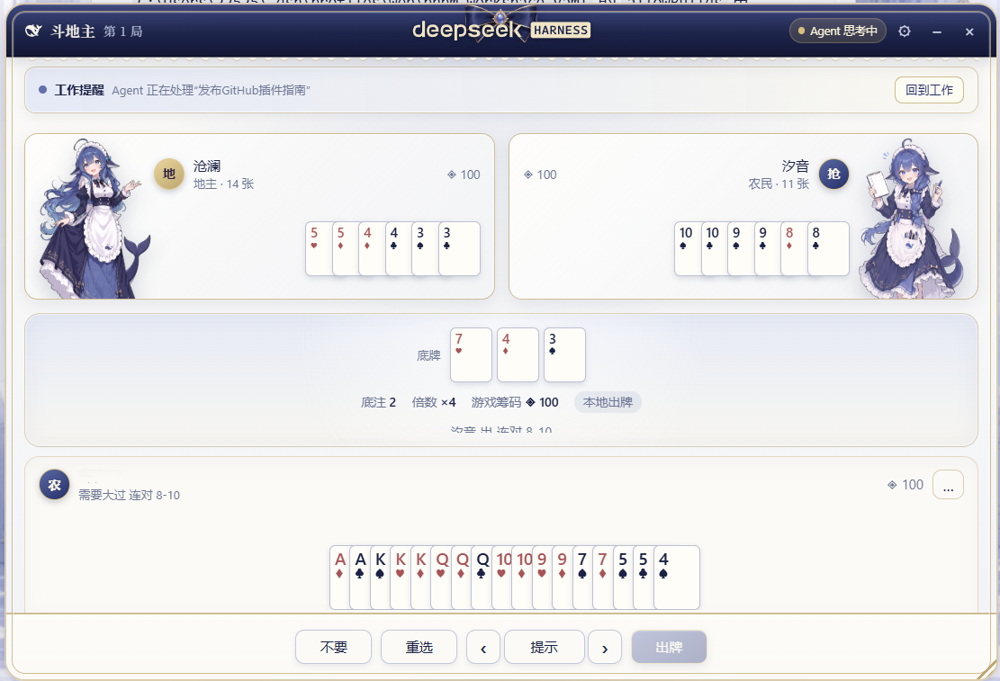

# dsh-doudizhu

**Your agent is thinking. Deal you in.**

Play a hand of three-seat Dou Dizhu (斗地主) in a floating window while DeepSeek
Harness is thinking — against two opponents that reason with DeepSeek.

`dsh-doudizhu` adds a **斗地主** action beside the active conversation title and opens a movable,
resizable, minimizable window through the supported `shell.overlay` slot. The
active agent keeps running underneath it, and so does the card game: a hand
carries on while the window is minimized or closed entirely.

## Product preview



*A three-seat Dou Dizhu table running alongside an active Harness task, with model-driven opponents, work reminders, and live agent status.*

> Entertainment only. Game tokens are local numbers with no monetary value. There are
> no deposits, withdrawals, purchases, accounts, or multiplayer wagering.

## What works

- Three seats: you plus two bots. The first hand randomly chooses who decides
  first; after that, the player who actually went out in the previous hand gets
  first choice to accept or decline the landlord. Once somebody accepts, later
  players may rob in order and the first claimant may counter-rob. Every
  successful rob doubles the multiplier; if everyone declines, the cards are
  redealt and first choice rotates.
- Full combination rules: singles, pairs, triples with single or paired wings,
  straights, pair straights, planes with or without wings, four-with-two, bombs,
  and the rocket
- Correct trick flow — two passes return the lead to the trick's owner
- A continuous 300-token table: every seat starts at 100, winnings transfer
  directly between players, balances carry across hands, and an all-in bust
  ends the match without ever creating negative tokens
- **Model opponents**: each bot turn is a real DeepSeek call routed through the
  harness's own `llm` service, using the credentials and provider you already
  configured. No API key lives in the browser.
- A local heuristic bot that takes over instantly whenever the model is off,
  slow, unreachable, or answers with something unusable
- Click or drag across cards to select them, with an exact legality message and
  previous/next hints that cycle through every legal play
- Quick table talk with immediate personality-matched replies from both
  opponents, plus contextual reactions to landlord grabs, bombs, short hands,
  victories, and busts; model speech rides along with the normal move call and
  does not add another model request
- A compact work reminder follows the current Harness task: it reports active
  work, raises approvals, plan reviews, and questions above the game, announces
  completion, and provides one-click return to the conversation
- Floating window: drag by the title bar, resize from the corner, minimize to a
  corner pill, or close it — the hand keeps playing either way
- The conversation-header action shows a dot when the table is waiting on your move
- A hand ends on a dedicated settlement screen, with the outcome, actual token
  transfer, and final seat ranking kept clear of the cards underneath
- Table state, window geometry, game tokens, and recent dialogue survive a page reload
- Live **Agent 思考中 / Agent 空闲** status
- Simplified Chinese and English UI

## How the model opponents work

The browser owns the rules. For each bot turn it enumerates every legal play,
trims the list to something readable, and posts a redacted view of the table —
the deciding seat's own cards, public card counts and token balances, recent
table dialogue, the play to beat, and the numbered candidates — to a loopback
route the host half registers.

The host renders the prompt, calls `ctx.llm.stream()`, and returns a single
candidate index. It never accepts a prompt from the browser, so the route cannot
be used as a general-purpose model proxy, and it is fenced to loopback origins.

The bundled profile runs the opponents on `deepseek-v4-pro` with
`reasoningEffort: high`. Its 512-token output budget leaves room for the small
structured answer while limiting wait time, and its timeout is 15 seconds.

A bot turn that fails for any reason falls back to the local policy, and the
table stops calling the model after three consecutive failures until you toggle
the setting or reset the table. Turn **对手由 DeepSeek 驱动** off in the window's
settings to play entirely offline and spend no tokens at all.

### Host configuration

The bundled configuration is shown below. Every field can still be overridden
when the plugin is wired into another profile.

```yaml
- id: dsh-doudizhu
  name: dsh-doudizhu
  config:
    provider: deepseek-official
    model: deepseek-v4-pro
    reasoningEffort: high  # off | high | max
    maxTokens: 512
    temperature: 0.7
    timeoutMs: 15000
```

## Install

```sh
dsh plugin --profile web add github:tongji-1/dsh-doudizhu
```

pnpm 10+ blocks the package's `prepare` build on first install; add the exact
key pnpm prints to `allowBuilds` in `$DSH_HOME/profiles/web/pnpm-workspace.yaml`,
then re-run:

```sh
dsh plugin --profile web install
dsh --profile web
```

Pin a release with `dsh plugin --profile web add github:tongji-1/dsh-doudizhu#v0.5.0`.

For a local checkout:

```sh
git clone https://github.com/tongji-1/dsh-doudizhu.git
cd dsh-doudizhu
pnpm install
pnpm check
dsh plugin --profile web add "$PWD"
dsh --profile web
```

## Development

```sh
pnpm install
pnpm check
```

The package has three halves:

- `lib/index.js`: the host plugin — one loopback route that turns a bot turn
  into a model call. Requires `webServer` and `llm`.
- `lib/client.js`: a browser bundle registering `conversation.session.header.actions` and
  `shell.overlay`
- `lib/engine.js`: the rules engine, independent of React and of the model,
  exported as `dsh-doudizhu/engine`

The engine never reads an opponent's hidden cards, and neither does the prompt:
a bot sees only its own hand, the public board, and how many cards everyone else
is holding.

## Why this is a separate repository

DeepSeek Harness is currently in developer preview and its contribution guide
says external pull requests are not accepted yet. The official ecosystem path is
an independent plugin repository tagged with the GitHub topic
[`dsh-plugin`](https://github.com/topics/dsh-plugin).

## License

MIT
